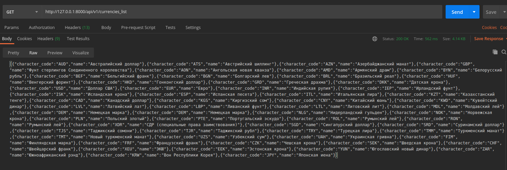

# Currencies API
Микросервис, предоставляющий http api, для показа разницы курса той или иной валюты относительно рубля за выбранные даты.

# Технологии

В проделанной работе был использован следующий стек технологий:

```Django```

```Django REST framework```

```Библиотеки requests и xml.etree.ElementTree```

### Django и DRF

Сервис написан с помощью фреймворка Django, так как эту технологию я знаю лучше всего и у нее есть библиотека Django Rest Framework (DRF), которая позволяет довольно легко и быстро создать API для нашего сервиса.

### requests и xml.etree.ElementTree

Библиотека **requests** нужна для отправки HTTP запросов на сайт [Банка России](http://www.cbr.ru/development/sxml/) для получения котировок в виде XML документа.

Стандартный модуль **xml.etree.ElementTree** нужен для парсинга XML дерева, так как API [Банка России](http://www.cbr.ru/development/sxml/) предоставляет данные в виде [XML документов](http://www.cbr.ru/scripts/XML_valFull.asp). 

# Работа сервиса

Сервис предоставляет 2 url-а:

```/api/v1/currencies_list``` - для получения списка всех валют в формате {символьный код валюты, название валюты} 

Пример:



```/api/v1/currency=<cимвольный код валюты>&date1=<первая дата>&date2=<вторая дата>``` - получение разницы курса относительно рубля между двумя датами в формате {выбранный курс относительно рубля за первую дату, выбранный курс за вторую дату, разницу между ними, разницу в процентах}

Примеры использования:

Доллар США за 2002-03-02 и 2020-03-02.


Казахстанский тенге за 2013-03-22 и 2019-05-05.


Швейцарский франк за 2016-06-22 и 2001-12-01.


# Вызов методов

Методы для работы с валютами находятся в [currency_services.py](https://github.com/Rizzrackez/CurrencyApi/blob/master/currency_api/backend/currency_services.py)

Ниже показан пример вызова метода для создания списка всех валют.


В примере ниже был вызван метод для получения разницы курса относительно рубля. В качестве параметров метод принимает символьный код валюты, первую и вторую дату в формате YYYY-MM-DD.


# Дополнительно

Некоторые валюты не имеют котировки за выбранную дату:


Как показано в примере выше, валюта под кодом R01435 (Литовский лит) с 2001 по 2002 год имеет котировку только в начале каждого месяца, поэтому узнать ее курс в другие дни месяца не является возможным. 

В этом случаи сервис выдает следующий ответ:


Также сервис не имеет базы данных, так как нет никакой необходимости использовать ее для наших задач.
